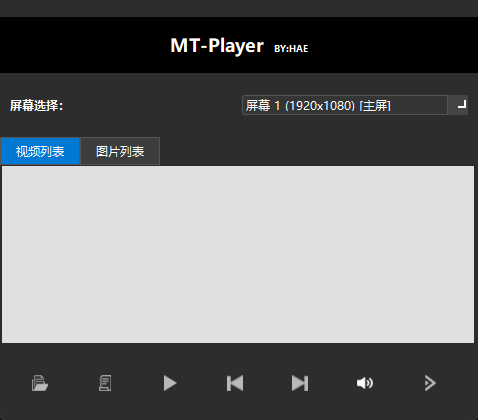

# 多屏播控播放器（MT-Player）

> 一款专为双屏/多屏场景设计的轻量级媒体播放工具，支持视频与图片的全屏投放，主窗口进行列表管理与控制，适用于展会、监控、广告轮播、图片展示等场景。


---

## 📝 更新日志

### v3.2.0 (2026-06-26) - 架构重构与安全加固
**🐛 关键修复**
- 🔴 **修复跨线程 GUI 操作（致命崩溃源）**：API/MCP 线程不再直接操作 PyQt6 控件，通过 `PlayerController` 信号机制编组回主线程
- 🔴 **修复图片全屏缩放错误**：改用 `KeepAspectRatio` 等比缩放 + `resizeEvent` 重算，支持任意分辨率副屏
- 🔴 **修复 API 零鉴权安全漏洞**：非 localhost 监听强制要求 `--token`，所有写操作端点校验 Bearer Token
- 🔴 **修复预览定时器资源浪费**：窗口隐藏/headless 模式自动停止截图
- 修复 `prev_media`/`next_media` 空指针崩溃（未检查 `player_window`）
- 修复损坏视频导致自动续播链卡死（处理 `InvalidMedia`/`NoMedia`）
- 修复裸 `except: pass` 吞异常（改为捕获 `TypeError`）

**✨ 架构优化**
- 新增 `MediaLibrary` 统一数据模型，GUI/API/MCP 三端共用，消除三处重复逻辑
- 新增 `PlayerController` 控制层，线程安全的跨线程调用机制
- API `--host` 默认值改为 `127.0.0.1`（不再全网监听）
- 用 `waitress` 替代 Flask 开发服务器（生产部署）
- `request.get_json(silent=True)` + 显式类型校验

**🎨 UI 改进**
- 标题栏右上角增加显式"退出"按钮（红色 hover）
- 屏幕选择行增加状态徽标（未投放/投放中）
- 7 个按钮全部补 `setToolTip`，图标加载失败时降级为中文文字
- 右侧预览面板增加标题，无信号时显示占位文案
- 投放后副屏显示加载提示，替换大部分 `QMessageBox` 为非阻塞 Toast
- `closeEvent` 改为三选一（最小化到托盘/退出/取消）
- 投放按钮 500ms 防抖，防止连击创建多个窗口

**📦 新增文件**
- `media_library.py` - 统一媒体数据模型（线程安全）
- `player_controller.py` - 跨线程控制层
- `requirements.txt` - 依赖锁定

**🔧 启动参数**
```bash
# 基础模式
python dual_screen_player.py

# 启用 REST API（默认仅监听 localhost）
python dual_screen_player.py --api --port 5000

# 非 localhost 监听（强制鉴权）
python dual_screen_player.py --api --host 0.0.0.0 --token YOUR_SECRET

# 启用 MCP 服务器
python dual_screen_player.py --mcp

# 无界面模式（后台服务）
python dual_screen_player.py --api --mcp --headless
```

---

### v3.0.0 (2026-01-15) - 代码优化与质量提升
**✨ 功能继承**
- 完整保留所有现有功能：视频投放、图片投放、屏幕预览

**🔧 代码优化**
- ✅ **消除代码重复**：删除了 70+ 行重复代码
  - 合并 `toggle_mute()`、`prev_video()`、`next_video()`、`pause_play()` 方法实现
  - 统一播放器方法逻辑，避免多个类中的功能冗余
- ✅ **提取常量配置**：将魔法数字集中管理
  - 窗口尺寸：`WINDOW_WIDTH = 820`, `WINDOW_HEIGHT = 420`
  - UI 元素：`ICON_SIZE = 32`, `PREVIEW_PANEL_WIDTH = 260`
  - 性能参数：`PREVIEW_UPDATE_INTERVAL = 500` ms
  - 支持格式：`SUPPORTED_VIDEO_EXTS`、`SUPPORTED_IMAGE_EXTS`
- ✅ **增强异常处理**：为所有关键操作添加完整的 try-except 块
  - 文件读取和文件夹遍历
  - 屏幕操作和媒体播放
  - 提供详细的错误信息反馈
- ✅ **改进日志系统**：替代所有 `print()` 为结构化 logging
  - 支持日志级别控制（INFO、WARNING、ERROR）
  - 便于生产环境调试和监控
- ✅ **代码行数优化**：839 → 815 行（精简 24 行）

**📖 文档改进**
- 为所有主要方法添加详细的文档字符串
- 改进代码注释清晰度，便于维护
- 添加代码分节标注（如 # === 标题栏 ===）

**🐛 问题修复**
- 修复屏幕预览异常时的处理机制
- 改进错误提示消息的用户友好度

---

### v2.1.0 (2026-01-14) - 屏幕预览功能发布
**✨ 新增功能**
- 🖥️ **实时屏幕预览**：右侧预览面板显示目标屏幕内容
  - 自动刷新预览（500ms 更新周期）
  - 支持多屏预览，选择屏幕后实时更新
  - 帮助用户确认投放屏幕位置
  - 屏幕预览面板宽度 260px，与主窗口等高

**🔧 界面改进**
- 扩展主窗口布局，左侧为控制面板，右侧为实时预览
- 提升屏幕选择的用户体验
- 屏幕预览面板设计美观专业，深色主题配合白色边框

**📊 功能完整度**
- 形成"所见即所得"的投放体验
- 用户可在投放前预览目标屏幕

---

### v2.0.0 (2026-01-13) - 图片投放支持发布
**✨ 新增功能**
- 📸 **图片投放功能**：
  - 支持 PNG、JPG、JPEG 格式图片
  - 图片自适应全屏显示（智能缩放）
  - 与视频列表独立管理（标签页切换）
  - 支持上一张/下一张快速浏览（循环）
  - 图片模式下播放/暂停按钮自动禁用（无播放意义）

- 📑 **标签页管理**：
  - 视频列表标签页：专门管理视频文件
  - 图片列表标签页：专门管理图片文件
  - 灵活切换播放内容，投放中可实时切换

**🔧 改进**
- 文件导入逻辑优化，自动识别视频和图片格式
- 从文件夹导入时自动分类处理（视频→视频列表，图片→图片列表）
- 完整的列表同步机制，确保投放内容与主窗口同步

**📊 应用场景拓展**
- 支持图片轮播展示（展会、商业展示）
- 支持视频+图片混合投放（灵活性提升）

---

### v1.0.0 (2025-12-31) - 初始版本，视频投放基础功能
**✨ 核心功能**
- 🎬 **视频投放**：
  - 支持 MP4、MKV、AVI、MOV、WMV、FLV、WebM 等 7 种格式
  - 全屏投放到指定屏幕，支持多屏显示环境
  - 视频自动循环播放（播完自动切换下一个）

- 🖱️ **播放控制**：
  - ▶️/⏸️ 暂停/继续播放
  - ⬅️/➡️ 上一个/下一个视频（循环切换）
  - 🔇/🔊 静音/取消静音

- 📂 **文件管理**：
  - 从文件夹批量导入视频
  - 添加单个或多个视频文件
  - 视频列表管理，避免重复导入

- 🎯 **屏幕选择**：
  - 自动识别所有连接的显示器
  - 支持多屏显示环境
  - 灵活选择投放目标屏幕

- 📌 **系统集成**：
  - 系统托盘集成，最小化到托盘
  - 双击托盘图标恢复主窗口
  - 优雅的关闭和退出机制

---

## 🚀 版本发展对比表

> **v3.2.0 重要安全提示**：API 默认仅监听 `127.0.0.1`（localhost）。如需局域网访问，必须通过 `--token` 参数设置鉴权令牌。

---

## 🔒 安全说明

### API 鉴权机制

v3.2.0 引入了 API 鉴权机制，防止未授权访问：

```bash
# 仅监听 localhost（默认，无需鉴权）
python dual_screen_player.py --api

# 局域网访问（强制鉴权）
python dual_screen_player.py --api --host 0.0.0.0 --token YOUR_SECRET_TOKEN
```

### 调用示例

```python
import requests

BASE_URL = "http://localhost:5000"
HEADERS = {"Authorization": "Bearer YOUR_SECRET_TOKEN"}

# 需要鉴权的请求
requests.post(f"{BASE_URL}/api/projection/start", headers=HEADERS)
requests.get(f"{BASE_URL}/api/status", headers=HEADERS)
```

### 安全建议

- 生产环境务必设置强随机 Token
- 不要在公共网络暴露 API 服务
- 定期更换 Token
- 使用 `waitress` 替代 Flask 开发服务器

---

## 📸 界面预览



> **主窗口功能展示**：  
> - 📱 顶部：应用标题 "MT-Player BY:HAE"  
> - 🖥️ 屏幕选择：下拉框选择投放屏幕，右侧实时预览  
> - 📑 标签页：视频列表 / 图片列表  
> - 🎛️ 控制栏：7 个功能按钮，界面简洁专业

---

## 🎛️ 按钮功能说明

| 序号 | 按钮图标 | 按钮名称 | 功能描述 | 使用场景 |
|-----|--------|--------|---------|---------|
| 1️⃣ | 📁 | **从文件夹导入** | 批量导入文件夹内所有视频或图片 | 导入大量媒体文件时使用 |
| 2️⃣ | ➕ | **添加视频** | 手动选择单个或多个视频/图片文件 | 精确添加特定文件 |
| 3️⃣ | ▶️ | **播放/暂停** | 控制视频播放状态（图片模式禁用） | 视频模式下暂停/继续播放 |
| 4️⃣ | ⬅️ | **上一个** | 切换到列表中的上一个文件（循环） | 快速浏览前一个媒体 |
| 5️⃣ | ➡️ | **下一个** | 切换到列表中的下一个文件（循环） | 快速浏览下一个媒体 |
| 6️⃣ | 🔊 | **静音/取消静音** | 切换视频音频状态（图片模式禁用） | 视频模式下控制音量 |
| 7️⃣ | 📡 | **继续投放/取消投放** | 启动或停止向副屏投放媒体内容 | 投放管理的核心功能 |

### 按钮详细说明

#### 1️⃣ **从文件夹导入** (📁)
- **按钮状态**：始终可用
- **功能**：打开文件夹选择对话框
- **自动识别**：
  - 视频格式：MP4、MKV、AVI、MOV、WMV、FLV、WebM
  - 图片格式：PNG、JPG、JPEG
- **工作流**：
  1. 点击按钮
  2. 选择文件夹
  3. 自动分离视频/图片到对应列表
  4. 避免重复导入（自动检测已存在文件）

#### 2️⃣ **添加视频** (➕)
- **按钮状态**：始终可用
- **功能**：打开文件选择对话框
- **支持格式**：视频 + 图片混合选择
- **工作流**：
  1. 点击按钮
  2. 选择单个或多个文件（Ctrl/Shift 多选）
  3. 自动分类到视频/图片列表
  4. 支持从任意位置导入

#### 3️⃣ **播放/暂停** (▶️/⏸️)
- **按钮状态**：
  - ❌ 未投放时：禁用（灰显）
  - ✅ 投放视频时：启用（可用）
  - ❌ 投放图片时：禁用（灰显，图片无需暂停）
- **功能**：
  - 显示 ▶️ 时：点击开始/继续播放
  - 显示 ⏸️ 时：点击暂停视频
  - 按钮图标实时反馈当前状态
- **工作流**：
  1. 启动投放
  2. 视频自动播放
  3. 点击按钮暂停
  4. 再次点击继续播放

#### 4️⃣ **上一个** (⬅️)
- **按钮状态**：
  - ❌ 未投放时：禁用
  - ✅ 投放中：启用
- **功能**：切换到列表中的上一个文件
- **循环播放**：
  - 第一个文件 → 点击 → 跳到最后一个文件
  - 支持无限循环切换
- **应用范围**：视频模式 ✅ / 图片模式 ✅

#### 5️⃣ **下一个** (➡️)
- **按钮状态**：
  - ❌ 未投放时：禁用
  - ✅ 投放中：启用
- **功能**：切换到列表中的下一个文件
- **循环播放**：
  - 最后一个文件 → 点击 → 跳到第一个文件
  - 支持无限循环切换
- **自动续播**：
  - 视频模式：播完自动跳下一个
  - 图片模式：需手动点击
- **应用范围**：视频模式 ✅ / 图片模式 ✅

#### 6️⃣ **静音/取消静音** (🔇/🔊)
- **按钮状态**：
  - ❌ 未投放时：禁用
  - ✅ 投放视频时：启用
  - ❌ 投放图片时：禁用（无音频）
- **功能**：
  - 显示 🔊 时：声音开启，点击静音
  - 显示 🔇 时：已静音，点击恢复音量
  - 按钮图标实时反馈音量状态
- **工作流**：
  1. 投放视频（默认有声）
  2. 点击按钮显示 🔇（静音）
  3. 再次点击显示 🔊（恢复）
- **应用范围**：视频模式 ✅ / 图片模式 ❌

#### 7️⃣ **继续投放/取消投放** (📡/❌)
- **按钮状态**：始终可用
- **功能**：投放管理的核心按钮
- **投放前的检查**：
  - ✅ 目标屏幕 ≠ 应用程序屏幕
  - ✅ 当前列表非空
  - ❌ 条件不满足时显示警告
- **按钮动态**：
  - 未投放时：显示 📡 **继续投放**
  - 投放中时：显示 ❌ **取消投放**
- **工作流**：
  1. 导入媒体文件
  2. 选择投放屏幕
  3. 点击 📡 **继续投放**
  4. 目标屏幕全屏显示媒体
  5. 按钮变为 ❌ **取消投放**
  6. 点击 ❌ 停止投放
- **投放中的操作**：
  - 可切换视频/图片列表 ✅
  - 可暂停/继续媒体 ✅
  - 可前/后切换文件 ✅
  - 可切换屏幕（需重新投放） ⚠️

---

## ✨ 核心功能

### 🖥️ 多屏支持
- 自动识别所有连接的显示器
- 防护机制：投放屏幕与应用程序所在屏幕必须不同
- 支持实时切换投放屏幕，无需重启投放

### 📹 媒体管理
- **视频列表**：支持 MP4、MKV、AVI、MOV、WMV、FLV、WebM 等格式
- **图片列表**：支持 PNG、JPG、JPEG 格式
- 批量导入：从文件夹一键导入所有视频/图片
- 手动添加：逐个添加单个文件
- 实时同步：投放中切换列表时自动更新全屏内容

### ▶️ 播放控制
- **视频模式**
  - 自动循环播放，视频播完自动切换下一个
  - 暂停/继续播放
  - 静音/取消静音
  - 手动前/后切换

- **图片模式**
  - 全屏显示图片，无自动播放
  - 仅支持手动前/后切换
  - 播放/暂停按钮禁用

### 🎛️ 投放管理
- **一键投放**：点击"继续投放"按钮立即全屏播放
- **动态切换**：
  - 投放中可随时切换视频/图片列表
  - 投放中可切换屏幕选择（需重新投放）
  - 投放中可暂停/继续媒体播放
- **一键取消**：点击"取消投放"按钮退出全屏

### 🎨 UI/UX
- 标签页设计：视频列表/图片列表分离管理
- 实时反馈：当前播放项目高亮显示（蓝色标记 + 播放符号 ▶）
- 图标按钮：14 个高清 PNG 图标，界面简洁专业
- 深色主题：护眼深灰配色，适合长时间使用

### 💼 系统集成
- 系统托盘：关闭主窗口后最小化到托盘
- 快速恢复：双击托盘图标或选择"显示主窗口"恢复
- 托盘菜单：显示主窗口 / 退出应用

---

## 📦 安装与运行

### 方式一：直接运行源码（推荐用于开发）
```bash
# 1. 克隆或下载项目
git clone https://gitee.com/your-username/dual-screen-player.git
cd dual-screen-player

# 2. 创建虚拟环境（可选但推荐）
python -m venv venv
# Windows:
venv\Scripts\activate
# macOS/Linux:
source venv/bin/activate

# 3. 安装依赖
pip install -r requirements.txt

# 4. 运行程序
python dual_screen_player.py
```

### 方式二：打包为 EXE（分发给用户）
```powershell
# 1. 安装 PyInstaller
pip install pyinstaller

# 2. 确保 img/ 目录存在且包含所有图标

# 3. 执行打包命令
pyinstaller --onefile --windowed `
  --add-data "img;img" `
  --icon "img/app.ico" `
  --name "MT-Player" `
  dual_screen_player.py

# 4. 生成的 exe 位于 dist/ 文件夹
```

> 打包后的 EXE 文件可直接在 Windows 7/10/11 上运行，无需安装 Python。

---

## 📂 项目结构

```
Dual_screen_player/
├── dual_screen_player.py      ← 主程序
├── media_library.py           ← 统一媒体数据模型（线程安全）
├── player_controller.py       ← 跨线程控制层
├── api_server.py              ← REST API 服务器模块
├── mcp_server.py              ← MCP 服务器模块
├── mcp_run.py                 ← MCP 独立启动脚本
├── requirements.txt           ← 依赖锁定
├── test_mcp.py                ← MCP 功能测试脚本
├── test_mcp_full.py           ← MCP 完整测试脚本
├── README.md                  ← 本文档
└── img/                        ← 图标资源文件夹
    ├── app.ico                ← 应用图标（EXE 打包 + 托盘）
    ├── app.png                ← 应用图标备用（PNG 格式）
    ├── 播放.png               ← 播放按钮
    ├── 暂停.png               ← 暂停按钮
    ├── 从文件夹导入.png       ← 导入文件夹按钮
    ├── 添加视频.png           ← 添加文件按钮
    ├── 上一个.png             ← 上一个按钮
    ├── 下一个.png             ← 下一个按钮
    ├── 取消静音.png           ← 取消静音按钮
    ├── 静音.png               ← 静音按钮
    ├── 继续投放.png           ← 开始投放按钮
    └── 取消投放.png           ← 停止投放按钮
```

---

## 🛠️ 技术栈与依赖

| 组件 | 版本 | 用途 |
|-----|------|------|
| **Python** | 3.10+ | 运行环境（推荐 3.10~3.12） |
| **PyQt6** | >=6.5.0 | GUI 框架 + 多媒体播放 |
| **Flask** | >=3.0.0 | REST API 服务器（可选） |
| **waitress** | >=2.1.0 | 生产级 WSGI 服务器（可选） |
| **MCP** | >=1.0.0 | MCP 协议支持（可选） |
| **PyInstaller** | 最新 | 打包 EXE（仅打包时需要） |

---

## 🌐 REST API 接口文档

### 启动 API 服务器

```bash
python dual_screen_player.py --api --port 5000
```

### API 端点列表

#### 投放控制
| 端点 | 方法 | 说明 |
|-----|------|------|
| `POST /api/projection/start` | 开始投放 | 可选 `{"screen_index": 0}` |
| `POST /api/projection/stop` | 停止投放 | - |
| `GET /api/projection/status` | 投放状态 | - |

#### 播放控制
| 端点 | 方法 | 说明 |
|-----|------|------|
| `POST /api/player/play` | 播放 | - |
| `POST /api/player/pause` | 暂停 | - |
| `POST /api/player/prev` | 上一个 | - |
| `POST /api/player/next` | 下一个 | - |
| `POST /api/player/mute` | 静音 | - |
| `POST /api/player/unmute` | 取消静音 | - |
| `GET /api/player/status` | 播放状态 | - |

#### 文件管理
| 端点 | 方法 | 说明 |
|-----|------|------|
| `GET /api/files/videos` | 视频列表 | - |
| `GET /api/files/images` | 图片列表 | - |
| `POST /api/files/add` | 添加文件 | `{"files": ["path1", "path2"]}` |
| `DELETE /api/files/video/<index>` | 删除视频 | - |
| `DELETE /api/files/image/<index>` | 删除图片 | - |
| `POST /api/files/clear` | 清空列表 | `{"type": "all/video/image"}` |

#### 屏幕管理
| 端点 | 方法 | 说明 |
|-----|------|------|
| `GET /api/screens` | 屏幕列表 | - |
| `POST /api/screens/select` | 选择屏幕 | `{"index": 0}` |

#### 状态与应用
| 端点 | 方法 | 说明 |
|-----|------|------|
| `GET /api/status` | 整体状态 | - |
| `GET /api/app/info` | 应用信息 | - |
| `POST /api/app/shutdown` | 关闭应用 | - |
| `POST /api/mode/switch` | 切换模式 | `{"mode": "video/image"}` |

### 调用示例

```python
import requests

BASE_URL = "http://localhost:5000"

# 获取屏幕列表
screens = requests.get(f"{BASE_URL}/api/screens").json()

# 添加文件
requests.post(f"{BASE_URL}/api/files/add", json={
    "files": ["C:/Videos/demo.mp4"]
})

# 开始投放
requests.post(f"{BASE_URL}/api/projection/start")

# 播放控制
requests.post(f"{BASE_URL}/api/player/next")
requests.post(f"{BASE_URL}/api/player/mute")

# 获取状态
status = requests.get(f"{BASE_URL}/api/status").json()
```

---

## 🤖 MCP 协议支持

### 配置 CoPaw / Claude Desktop

在 MCP 配置文件中添加：

```json
{
    "mcpServers": {
        "mt-player": {
            "command": "python",
            "args": ["<项目路径>/mcp_run.py"]
        }
    }
}
```

### MCP 工具列表

| 工具名 | 说明 |
|-------|------|
| `start_projection` | 开始投放 |
| `stop_projection` | 停止投放 |
| `get_projection_status` | 获取投放状态 |
| `play` | 播放视频 |
| `pause` | 暂停视频 |
| `prev_media` | 上一个媒体 |
| `next_media` | 下一个媒体 |
| `mute` | 静音 |
| `unmute` | 取消静音 |
| `get_player_status` | 获取播放状态 |
| `get_video_list` | 获取视频列表 |
| `get_image_list` | 获取图片列表 |
| `add_files` | 添加文件 |
| `delete_video` | 删除视频 |
| `delete_image` | 删除图片 |
| `clear_files` | 清空文件列表 |
| `get_screens` | 获取屏幕列表 |
| `select_screen` | 选择屏幕 |
| `get_full_status` | 获取完整状态 |
| `get_app_info` | 获取应用信息 |
| `shutdown_app` | 关闭应用 |
| `switch_mode` | 切换模式 |

### AI 助手使用示例

```
用户: 帮我在副屏投放一张图片
AI: [调用 get_screens → add_files → start_projection]
    已在副屏投放图片！

用户: 切换到下一张
AI: [调用 next_media]
    已切换！

用户: 关闭播放器
AI: [调用 shutdown_app]
    播放器已关闭。
```

---

## 📖 使用指南

### 基本操作流程

#### 1️⃣ 导入媒体文件
- **从文件夹导入**：点击 📁 按钮，选择包含视频/图片的文件夹
  - 自动识别视频格式：`.mp4`, `.mkv`, `.avi`, `.mov`, `.wmv`, `.flv`, `.webm`
  - 自动识别图片格式：`.png`, `.jpg`, `.jpeg`
- **手动添加**：点击 ➕ 按钮，选择单个或多个文件

#### 2️⃣ 选择投放屏幕
- 点击"屏幕选择"下拉框，选择目标屏幕
- ⚠️ **重要**：投放屏幕不能与应用程序所在屏幕相同
- 主屏幕会标记为 `[主屏]`
- 右侧预览面板实时显示选中屏幕内容

#### 3️⃣ 开始投放
- 点击 📡 "继续投放"按钮
- 目标屏幕立即全屏显示媒体
- 按钮变为 ❌ "取消投放"

#### 4️⃣ 播放控制（投放中）
| 功能 | 快捷按钮 | 说明 |
|-----|--------|------|
| **上一个** | ⬅️ | 切换到上一个文件（循环） |
| **下一个** | ➡️ | 切换到下一个文件（循环） |
| **播放/暂停** | ▶️/⏸️ | 仅视频模式有效，图片模式禁用 |
| **静音/取消** | 🔇/🔊 | 仅视频模式有效 |

#### 5️⃣ 列表切换（投放中）
- 点击"视频列表" / "图片列表"标签页
- 全屏显示内容自动同步更新
- 无需停止投放，流畅切换

#### 6️⃣ 停止投放
- 点击 ❌ "取消投放"按钮
- 全屏窗口关闭，内容恢复到应用程序窗口（若有）

---

## ⚙️ 高级设置

### 支持的视频格式
```
MP4, MKV, AVI, MOV, WMV, FLV, WebM
```

### 支持的图片格式
```
PNG, JPG, JPEG
```

### 屏幕识别逻辑
- 应用启动时自动扫描所有连接的显示器
- 会话期间动态添加屏幕时，需点击下拉框触发刷新
- 分辨率和刷新率信息显示在下拉框中

### 防护机制
投放前会验证以下条件：
- ✅ 投放屏幕与应用程序所在屏幕**不同**
- ✅ 选定模式下**列表非空**（有媒体文件）

---

## 🐛 常见问题与故障排除

### Q1：为什么无法投放？
**A**：检查以下条件：
1. 是否选择了与应用程序相同的屏幕？ → 选择其他屏幕
2. 列表是否为空？ → 导入视频/图片
3. 是否连接了两个或以上的显示器？ → 连接副屏

### Q2：图片投放后显示黑屏？
**A**：
1. 检查图片路径是否包含中文或特殊字符 → 改用英文路径
2. 图片格式是否为 PNG/JPG? → 转换为支持的格式
3. 重启应用程序后重试

### Q3：切换列表后没有同步？
**A**：
1. 确保投放状态下（按钮显示"取消投放"）
2. 新列表是否有内容？ → 导入媒体文件
3. 刷新页面后尝试

### Q4：视频播放时无声音？
**A**：
1. 检查静音按钮状态（图标为 🔇 表示已静音）
2. 系统音量是否打开？ → 调整 Windows 音量
3. 视频文件本身是否有音频轨道？ → 使用其他播放器确认

### Q5：如何彻底关闭程序？
**A**：
1. 点击托盘图标右键菜单"退出"
2. 或点击主窗口标题栏"X"后，再从托盘"退出"

---

## 🔧 开发者信息

### 项目架构
```
PlayerWindow          ← 全屏投放窗口（QMainWindow）
  ├── QStackedWidget  ← 切换容器
  │   ├── QVideoWidget    ← 视频显示
  │   └── QLabel          ← 图片显示
  └── QMediaPlayer    ← 媒体播放引擎

VideoPlayerApp        ← 主控制窗口（QMainWindow）
  ├── QTabWidget      ← 视频/图片列表
  ├── QComboBox       ← 屏幕选择
  └── QListWidget×2   ← 列表显示
```

### 关键类与方法
| 类 | 方法 | 功能 |
|----|------|------|
| `PlayerWindow` | `set_video_list()` | 加载视频列表 |
| | `set_image_list()` | 加载图片列表 |
| | `play_video()` | 播放指定视频 |
| | `play_image()` | 显示指定图片 |
| `VideoPlayerApp` | `start_projection()` | 启动投放（含屏幕检查） |
| | `stop_projection()` | 停止投放 |
| | `sync_projection_content()` | 同步列表内容 |
| | `check_different_screen()` | 屏幕冲突检查 |

### 信号连接
- `tab_widget.currentChanged` → `on_tab_changed()` 列表切换事件
- `player_window.currentIndexChanged` → `sync_*_list_selection()` 播放项目同步

---

## 💡 使用场景

| 场景 | 用途 |
|-----|------|
| 🏪 门店展示 | 循环播放商品宣传视频 |
| 🎪 展览会 | 多屏联动展示产品信息与图片 |
| 📊 会议室 | 全屏演示PPT录像或视频 |
| 📺 信息屏 | 广告、滚动图片、通知展示 |
| 📹 监控中心 | 多屏视频监控回放 |
| 🎓 培训室 | 教学视频全屏播放与管理 |

---

## 👨‍💻 贡献指南

欢迎 Fork、提交 Issue 和 Pull Request！

### 本地开发步骤
```bash
# Fork 此项目
git clone https://github.com/your-username/dual-screen-player.git

# 创建特性分支
git checkout -b feature/your-feature

# 提交更改
git commit -am 'Add some feature'

# 推送到 GitHub
git push origin feature/your-feature

# 创建 Pull Request
```

---

## 👤 作者

**HAE** - 创意来自实际工作中对双屏播放工具的需求

> 如果你觉得这个小工具有用，欢迎点个 ⭐ **Star** 支持！
> 
> 💬 **说句话**：这个项目花费了不少时间和精力，你的支持是我继续完善的动力！

---

**Last Updated**: 2026-06-26 | © MIT License

> 📌 **查看优化详情**：请参考 [OPTIMIZATION_REPORT.md](./OPTIMIZATION_REPORT.md) 了解 v3.0.0 版本的详细改进
